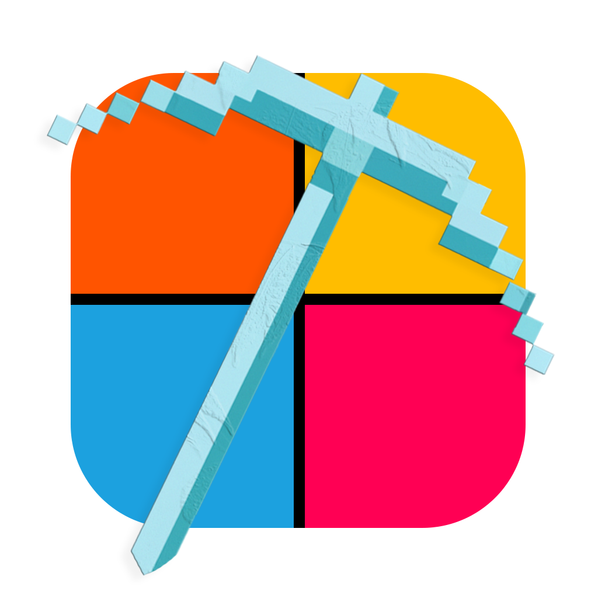

# Mosaico Software

Welcome to the Mosaico IDE repository!
This is a dummy IDE that allows you to quickly get started creating widgets for the Mosaico LED matrix ecosystem.

---

## Table of Contents

1. [Introduction](#introduction)
2. [Requirements](#requirements)
3. [Installation](#installation)
---

## Introduction
Mosaico allows users and developers to create, share, and display custom widgets on an LED matrix.
More infos about the project can be found on the [Mosaico Website](https://mosaico.murkrowdev.org).

## Requirements
- Flutter SDK

---

## Installation
For now, no binaries are provided. Just clone the repository and run the project with Flutter.

---

## Contributing

We welcome contributions! Feel free to open an issue or submit a pull request.

---

## License

This software is licensed under the AGPL-3.0 License. A copy of the license can be found in the [LICENSE](./LICENSE) file.

---

Feel free to reach out if you have any questions or need further assistance!